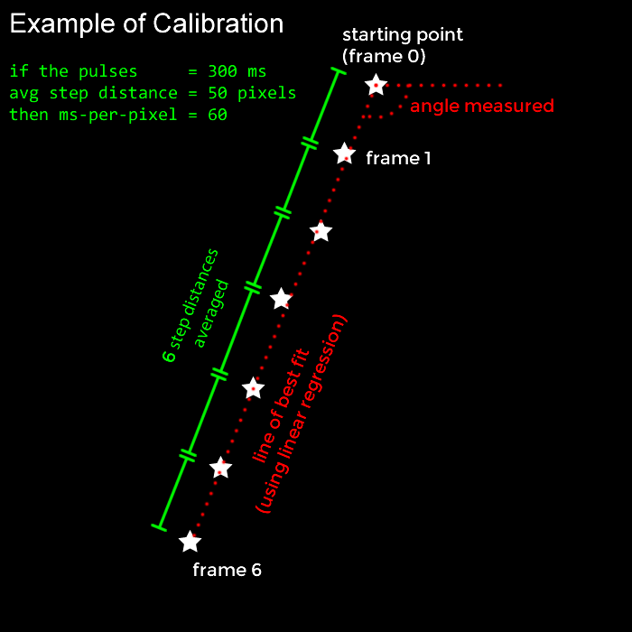
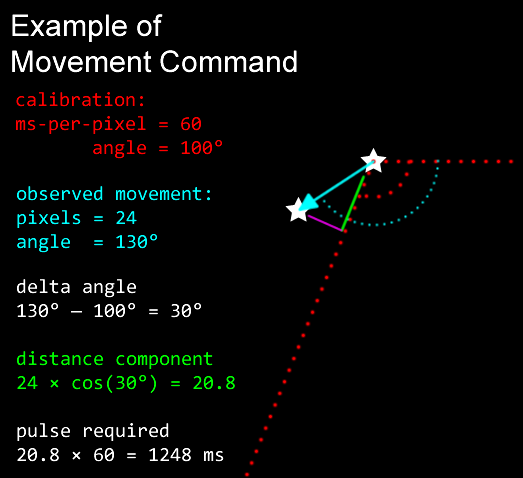
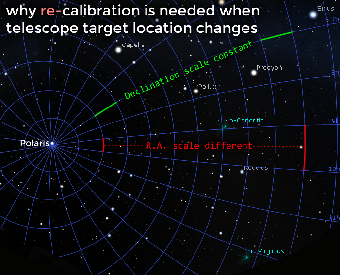

## Basic Algorithm

Before the autoguider can generate corrective movement commands, it needs to be calibrated first. Both axis (right-ascension and declination) needs to be calibrated independantly.

Calibration is done by sending a series of ST-4 signal pulses, which will cause the telescope mount to move. When it moves, the stars in the image will also move. The location of the star will be tracked, so that the average angle can be measured, and the distances of the movements are averaged. The unit ms-per-pixel is calculated from these distances and used for future corrective movements.

Remember that this is done independantly for the right-ascension axis and declination axis. Since these telescope mounts are equatorial mounts, the amount of observed star movement in the right-ascension axis is different depending on where in the sky you are actually looking.

So the calibration must be done again every time you point your telescope somewhere different.

The calibration process is automatic, and can be saved. Saved files can be loaded for the purposes of continuing autoguiding quickly after a power-loss.

A keen eye will notice that the algorithm will not work once the telescope is pointed very close to the celestial pole. This is true. The area of the sky above 80° of declination will probably cause the star motion tracking algorithm to fail. However, this is acceptable, as there's nothing really pretty to photograph in that area of the sky.

## Predictive Filtering

The basic algorithm is a reactive algorithm, it sees a mistake has been made, and then corrects it. The bad news is that by the time the correction has taken place, some photons have already missed their target in the photograph. So
the autoguider also implements algorithm to predict errors and attempt to correct them before they occur. This sounds fancy, but in reality, it's just a P.I.D. controller, a L.P.F. filter, and a direction lock algorithm.

Remember that the R.A. axis is always spinning in order to track the sky as all stars rises in the east and sets in the west. If the telescope mount is accurately polar aligned, then in theory, the declination axis of the telescope mount should never need to move. This means:

 * tracking errors in the R.A. axis is mostly caused by mechanical imperfections, such as microscopic bumps on the gears
 * the R.A. axis does not suffer a lot from backlash, because the spin is always in one direction, ST-4 pulses usually only change that speed more or less by 50%
 * tracking errors in the declination axis is mostly caused by bad polar-alignment
 * the declination motor can be subject to backlash

Some advanced autoguiding techniques exist to take advantage of those facts above. For the R.A. axis, it is possible to record every single imperfection of the gears, and since the gears run in a repeating circle, the errors can be predicted and corrected right before they actually happen. This is called periodic error correction (P.E.C.). However, with OpenMV, it is not practical to implement, and the gain vs effort isn't worth it for me.

For the declination axis, it will have a tendency to spin very very slowly in one direction. To avoid oscillation problems caused by backlash, the firmware will check which direction it has a tendency for, and then only allow it to spin in that direction in the future. Further more, the P.I.D. controller and L.P.F. filter will also track the direction, and their outputs can be used to pre-emptively make corrective moves in that direction very early.

Other sources of error are things like a gust of wind, or atmospheric seeing. These are considered very quick events, and ones that will naturally return to its original position. It is actually preferable not to issue corrections for these events, as they can result in over-correction.

----------

[click here to go back to the autoguider page](https://frank26080115.github.io/OpenMV-Astrophotography-Gear/doc/Auto-Guider)
