# Autoguider

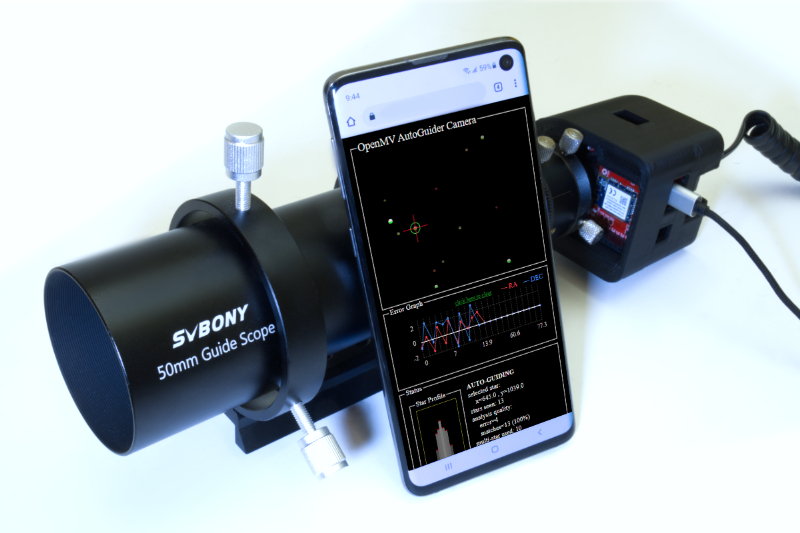

Autoguiders are cameras that command a motorized equatorial telescope mount to track a particular star in the sky. This allows astrophotographers to take extremely long exposure photos, as the tracking will eliminate star-streaking and blurriness caused by incorrect motion (mechanical imperfections of the gears) and error in polar-alignment.

[Wikipedia page on Autoguider](https://en.wikipedia.org/wiki/Autoguider)

When the autoguider detects that stars are moving in the image it sees, it will tell the motors to make very tiny corrections, to keep the stars where they were originally.

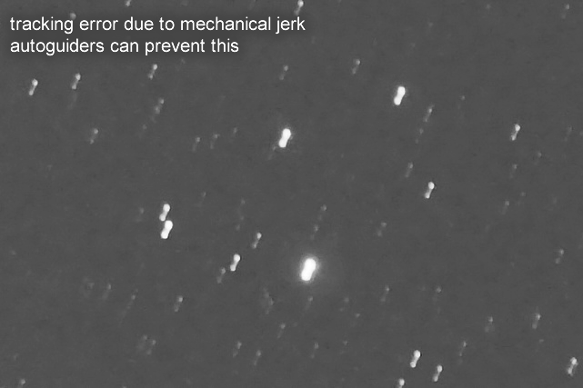

Current popular autoguider cameras are expensive and require a computer to run special software (such as PHD2). My project goal is to eliminate the need for a computer by using OpenMV instead, allowing for my gear to be more portable.

My OpenMV AutoGuider uses OpenMV's sensor and image processing algorithms to track the stars. I've designed a special "shield" that allows it to send ST-4 signals to any motorized equatorial telescope mount that has a ST-4 input port. The user interface is built as a web interface, served by a WiFi shield and a web server running on the OpenMV.

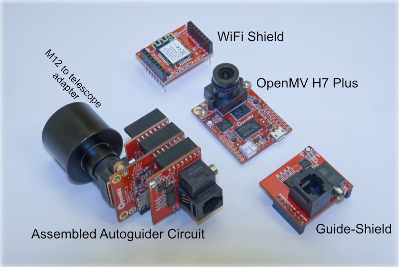

The autoguider is inserted into a small guide-scope. This is done by replacing the stock lens of the OpenMV with a M12-to-1.25inch adapter. The guide-scope I chose is a cheap Svbony SV106, which has a 50mm diameter objective lens with 190mm of focal length. The entire circuitry is protected by a 3D printed housing.

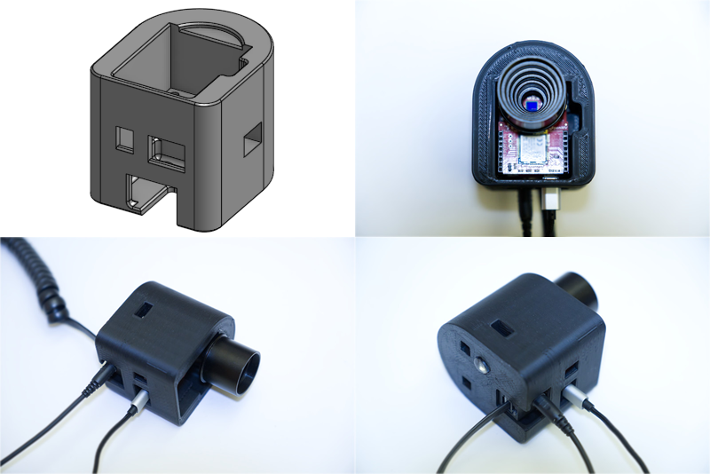

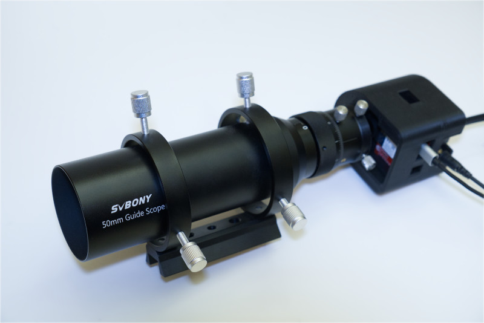

Here's a sample image of what the OpenMV sees through a typical guide-scope:

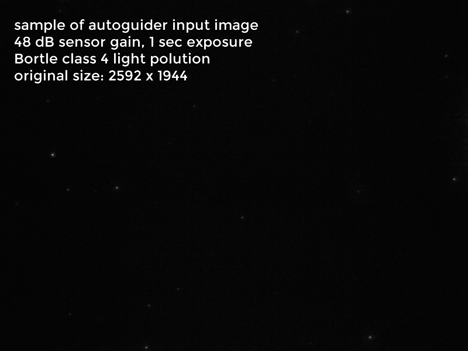

Those stars may look faint, but they are very trackable!

### Star Tracking and Analysis

[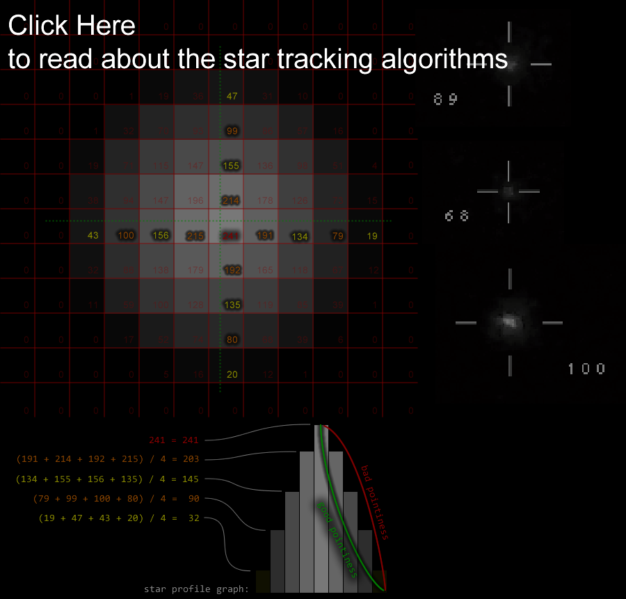](Star-Tracking-and-Analysis)

### Corrective Movements

[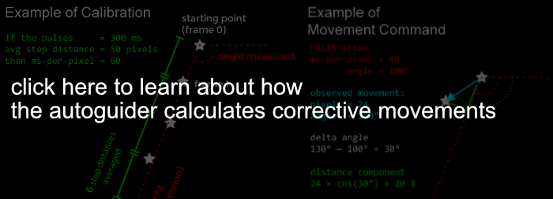](Auto-Guider-Corrective-Movements)

### Intervalometer and Dithering

This autoguider has hardware that allows it to be a camera intervalometer. An intervalometer is something that makes a camera take pictures repeatedly at regular time intervals. This is convenient for astrophotography, and also allows the user to perform **dithering** automatically.

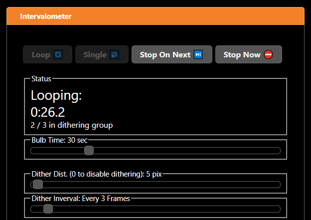

The intervalometer has basic intervalometer capabilities, such as taking repeated long exposure photos on a loop. It can also take single photos for the purposes of testing exposure settings. The loop can be paused without ruining the currently running exposure.

[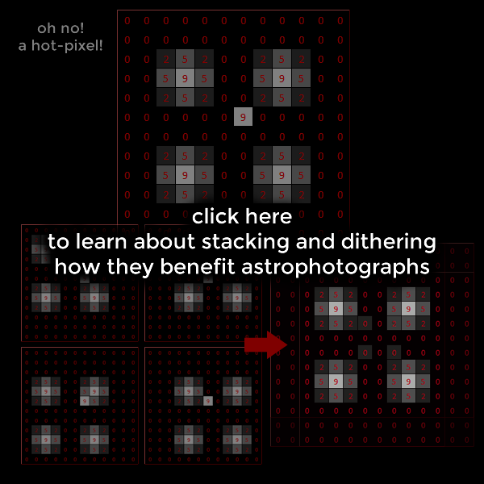](Stacking-and-Dithering)

To be able to do dithering, an autoguider is required as randomized dithering without tracking may lead the main telescope to go off-target. But the dithering movements must happen while the photo camera's shutter is closed, so the autoguider needs to coordinate with the intervalometer somehow. The solution is to simply build the intervalometer signal output into the same circuit that generates the ST-4 pulse signals. A 3.5mm jack for an intervalometer output is placed beside the ST-4 output port on the special shield I designed.

### Circuitry

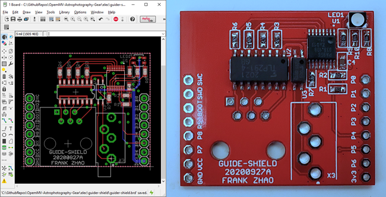

The special shield I designed uses a I2C port expander chip to add GPIOs to the OpenMV (which didn't have enough GPIOs for the job). The expander adds enough signals for the ST-4 signals, the intervalometer, and a RGB LED indicator. As the ST-4 signals require a bit of timing accuracy, the firmware to drive the I2C bus is written in the C back-end firmware to avoid function call overhead and the garbage collector of MicroPython.

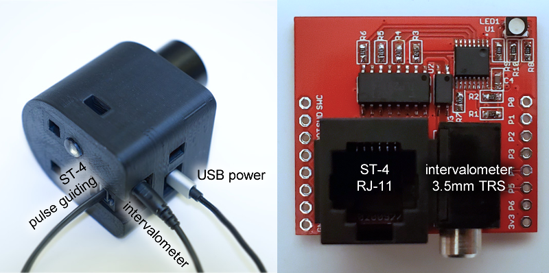

All of these outputs are opto-isolated. This is a nice feature as all the equipment involved are very expensive, and it prevents massive ground-loops from being formed.

### Web Interface

The web interface is a HTML page served from the microSD card using a HTTP server implemented in MicroPython. There is a configuration file that is used by the WiFi chipset to know which WiFi access point to connect to (with login credentials), if it fails to connect to an existing access point, it will default to becoming its own adhoc access point. Out in the field, the user can use a smartphone to access the web interface, either by using a hotspot, or by using the adhoc access point.

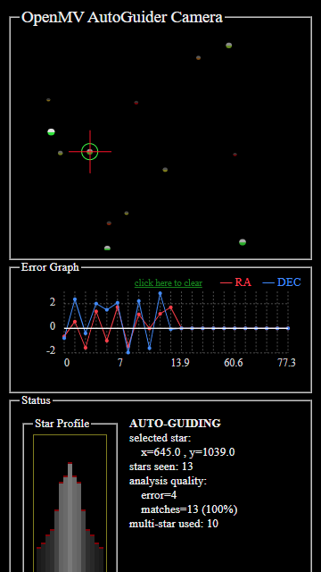

The web interface uses [jQuery](https://jquery.com/) and [jQuery-UI](https://jqueryui.com/) to make the nice looking UI elements. The error graph is draw using [Chartist by gionkunz](http://gionkunz.github.io/chartist-js/). The toast messages are generated using [js-toast by mlcheng](https://github.com/mlcheng/js-toast). The usage of these modern JavaScript packages ensure that the GUI scales to any screen size very nicely.

The image from the camera is shown as a SVG, not the true image, due to the bandwidth constraints of the slow WiFi chipset. Star coordinates and properties are sent over to the JavaScript, and the SVG simply draws some circles. The circle's size, brightness, and color, are changed according to the properties of the star. At a glance, the user can make quick inferences and decisions from just how the circle looks, without the actual image.

Live image streaming is still possible, for the purposes of adjusting guide-scope focus, but it halts all image processing. Each full resolution JPG is more than 2 megabytes (even after compression), which would take **a second or two** to transfer over WiFi. As the OpenMV is a single core processor, this can't happen on another thread, so there's simply no time left for processing if the image is being live-streamed.

Status, settings, and command data traveling between the server and the web browser uses WebSocket.

This architecture is extremely easy to debug while sitting at a desktop computer, thanks to the developer tools built into all modern web browsers. I can use the JavaScript debugger, console logs, network analyzer, and even simulate a smartphone screen.

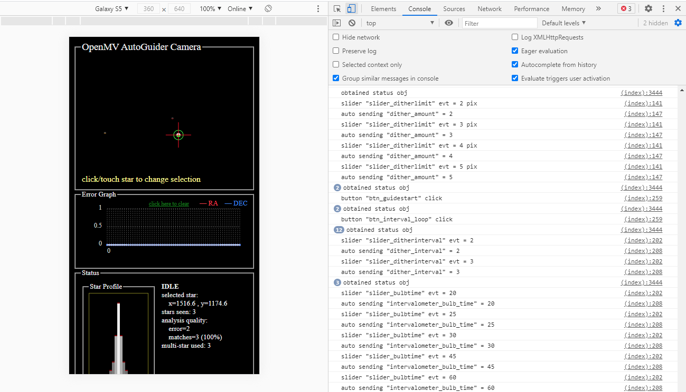

Once the autoguider is fully configured, calibrated, and running, **the smartphone can be disconnected and the autoguider will continue to operate throughout the night**. If it encounters an unrecoverable error, it will rapidly flash the red LED.

The HTML page also features collapsible help text, to help the user understand each function and setting. There are also some handy calculators that can help determine the most optimal settings.

### Comparison to Others

A popular entry level guide camera is the ZWO ASI120MM.

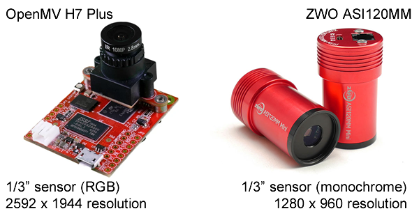

 n theory, this means the ZWO camera is more sensitive to light but the OpenMV should have double the tracking accuracy. This sounds great but the additional risk is that a larger image takes more time to analyze, especially without a powerful processor. The ZWO camera may be easier to process but the OpenMV has a high-speed direct interface between the sensor and microcontroller, while the ZWO camera only has USB 2.0 transfer capability. It's really hard to quantitatively compare the two.

Some of the algorithms I implemented are inspired by the popular PHD2 autoguiding software. Features from PHD2 that I've implemented:

 * single star tracking
 * multiple star tracking
 * dithering
 * calibration
 * direction lock-in
 * predictive filtering (but not PEC)
   * I implemented the filters as simple digital LPF and PID controllers, while PHD2 uses more detailed history analysis

Notably, some features require more hardware or astrophotography experience that I currently lack:

 * Periodic Error Correction
 * automatic configuration (the guiding assistant)
 * ASCOM control over equatorial telescope mount
 * drift alignment

Also, my user interface is much more simple and mostly unit-less (I have a closed ecosystem, while PHD2 supports all possible cameras). PHD2 has a more detailed UI. However, my error graph implementation features tracking shutter status and accumulated errors.

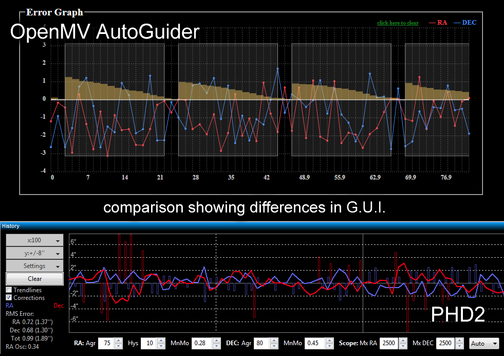

There are other "standalone" autoguiders on the market. The NexGuide or SynGuider only has 752 x 480 resolution at $300 (with poor user reviews, and require bigger guide-scopes). Better ones like StarAid or Lacerta costs well over $1000.

NOTE: I cannot personally make any qualitative comparisons as it would be extremely expensive to purchase the equipment required (multiple autoguiding cameras, plus additional telescopes that can show the differences between them), and astrophotography involves many other factors that may affect how good a photo looks. Photos from one night may simply look better due to weather.

### Development Difficulties

Some of the algorithms run extremely slowly, and things written in MicroPython are extremely memory intensive. Any algorithm that had to run in O(n) time or worse was written into the C back-end firmware. The find_blob function is already written in C but the data structure that represented each blob was very heavy on memory, so that data structure had been lightened-up by removing useless attributes (e.g. convexity). Some sheldom-changed MicroPython scripts are pre-compiled into flash memory instead of being loaded into the interpreter at runtime.

Doing all this cut the processing time for each frame from 2 seconds down to less than 0.5 second, which is great since the frame rate is 1 frame-per-second.

The down-side is that the code becomes less accessible, and in-field code changes are no-longer possible.

Since writing code outdoors is difficult, especially in the winter months, a simulator was written to enable development at home. The simulator can analyze static image files and then randomly move the stars around to simulate movement.

As discovered in the previous [polar-scope project](Polar-Scope), the HTTP server has trouble handling multiple HTTP requests simultaneously. This HTTP server will append required JS and CSS files right into the HTML page being served, to avoid additional HTTP requests. This is also why WebSocket is used, to reduce additional HTTP requests. Even graphic files are converted to base 64 data URLs so that they are not being loaded as a file HTTP request.

### 3D Printed Guide-Scope

I attempted to 3D print a guide-scope, using a 50mm diameter 183mm focal length lens.

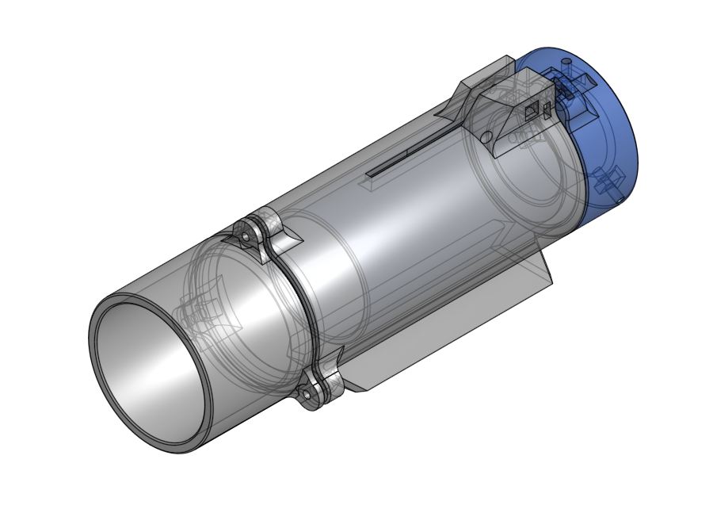
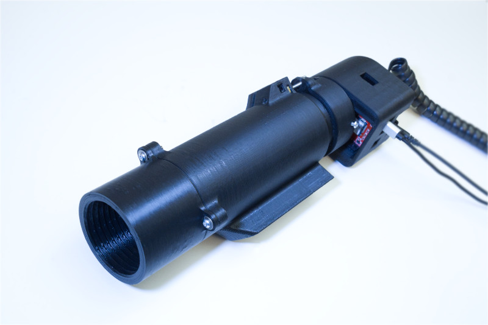

This does work, and is fun to build. The lens is sandwiched between the lens hood and the main tube. The focus mechanism consists of one screw that can move the telescopic inner tube. The rear has an opening allowing for any standard 1.25 inch diameter eyepiece, or in this case, camera, to be attached.

It's got some flaws:

 * requires a straight torx key to adjust focus
 * ordinary plastic is very reflective, should use matte black plastic, or coat the inside

If this method is not appealing, the recommended off-the-shelf guide-scope is a Svbony SV106. This guide-scope has a 50mm diameter lens with 190mm of focal length. It's easier to focus and aim, but doesn't look very sleek. The large diameter allows for enough light that the RGB sensor of the OpenMV is not at a disadvantage anymore. The focal length makes it suitable for even the longest refractor telescope you can buy when you combine it with the higher sensor resolution of the OpenMV.

### Other Project: Polar Scope

A polar scope is used to polar-align star-tracking camera mounts and equatorial telescope mounts. A digital camera version that leverages OpenMV computer vision algorithms can achieve much better accuracy, improving the quality of astro-photographs! With a WiFi connected web UI, it's way more convenient to use.

