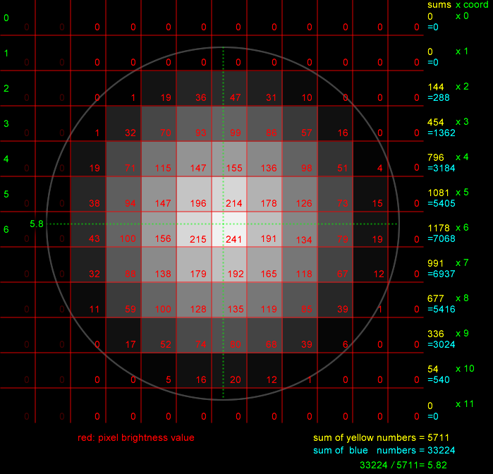
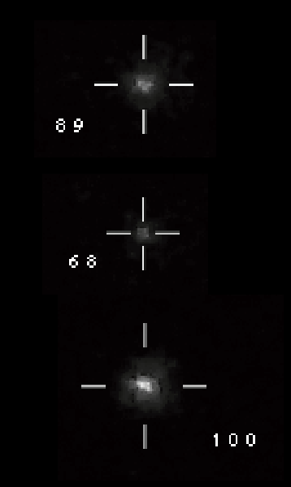
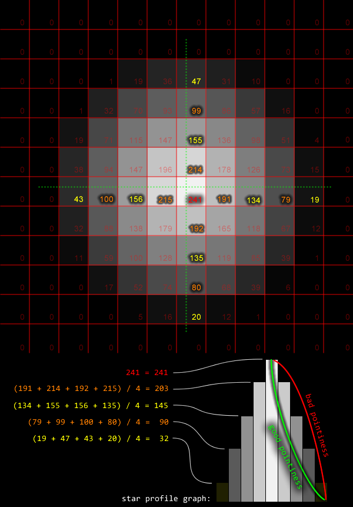
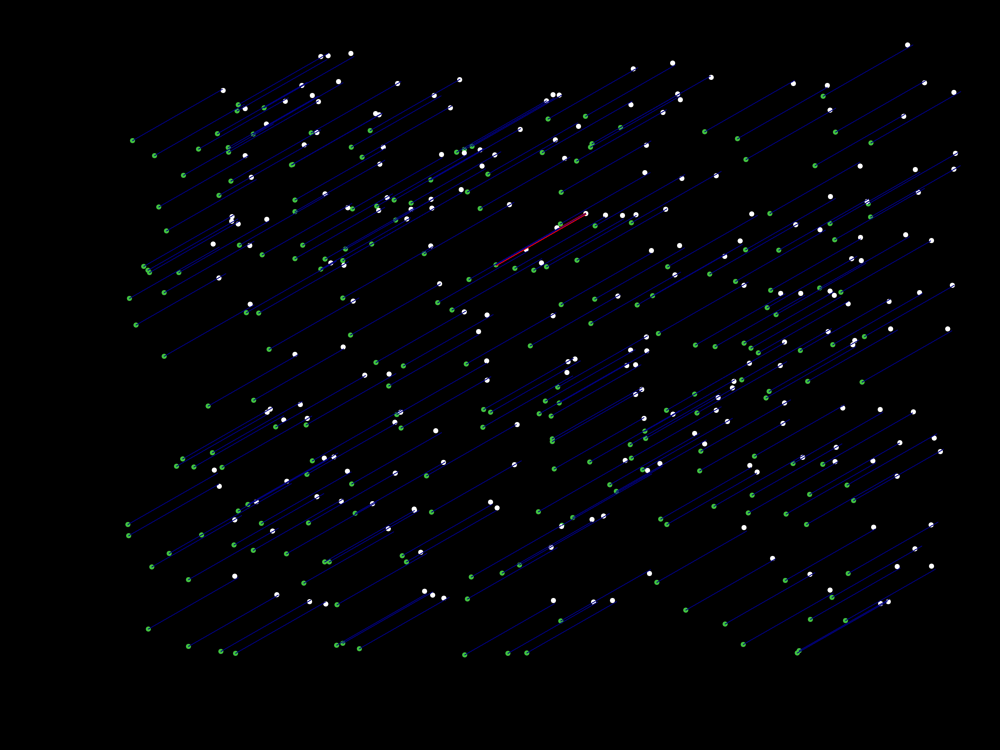

Accurate Star Tracking
======================

OpenMV has built-in image processing functions to detect blobs. We can detect stars as blobs if we set a threshold of brightness for a group of pixels to be considered a star. OpenMV can return us a list of blobs from an image, with the centroid coordinate of each blob. This works OK but we can do better.

Depending on the optical specifications of a auto-guidance system, the actual movements of a star in the camera's view can be very small. We would like to be able to track a star with precision that's more granular than even a pixel. More precise tracking means more precise guidance, and leading to sharper astrophotos.

To achieve this, an algorithm is used based on the concept of weighted-averaging. The algorithm averages coordinate, using brightness as weight. Below is an illustration of how the algorithm works:

Notice that the center of the star is the brightest pixel. The surrounding pixels are a bit darker but the pixels above the center and to the left of the center are brighter than the pixels below the center and to the right of the center. This is a hint that the true center-point is slightly towards the top-left of the center pixel.

Please note that when the algorithm starts, it doesn't actually know that the 241 pixel is the rough center. We also can't just take the center 9 pixels and analyze that because there's a chance that all 9 pixels are saturated (all 255, the brightest possible pixel value).

The image above illustrates how it calculates the precise Y coordinate of this star. It divides the image into rows. For each row, it sums up all the pixel brightness values for that row (yellow number). Then that number is multiplied by the row-index (row-index is green), resulting in a very large number (blue). The blue numbers are summed, and the yellow numbers are summed. The blue sum is divided by the yellow sum, and the result is 5.82 which is a much more precise coordinate than just 6.

(for the X coordinate, it will do the same steps but with columns)

The algorithm works well in real world testing:

For reference, with a sub-$100 guide-scope of 190mm focal length, the periodic error observed from a Orion Sirius EQ-G (also equivalent to a Sky-Watcher HEQ5) tracking mount results in stars moving about 24 pixels. With default settings, 24 pixels corresponds to corrective ST-4 pulses that are 120 ms long. These numbers are very achieveable and easy to work with.

This algorithm is a bit expensive and requires care when allocating memory. It is implemented in C instead of MicroPython for speedy execution.

Ideal Stars
===========

There are some stars that are easy to track, and some stars that are not. If a star is too dim, then it may suddenly become too dim to detect, and the guidance will fail. If a star is too bright, it might have many saturated pixels in the center, which can lead to the star center being hard to pin-point.

The auto-guider's WiFi transfer speed is very low so sending a raw full-resolution image to the user should be avoided. This means a human cannot be used to determine if a star is easy to track. Also, the auto-guider implements multi-star tracking, and forcing a human to select many stars is tedious. The auto-guider will instead use an algorithm to rank the stars based on how easy it is to track accurately, and automatically select the stars to be used.

To perform the ranking, it calculates how "pointy" a star is.

A pointy star is a star that is bright in the middle, but the brightness drops off quickly. If a star is very saturated in the center, then the brightness will not drop off at all. If the drop-off is quicker, then the star is considered more pointy.

The drop-off in brightness from the center is visualized as a star profile graph, which is sort of a cross-sectional representation of a 2D star image. This is shown to the user as a way to verify the automatically selected star, and to aid in manually overriding the star selection.

The ranking also penalizes the rank for these metrics:
 * too dim, to ensure the star won't disappear
 * too close to other stars, to avoid the movement analysis algorithm getting confused
 * too close to edge of image, to ensure the star won't disappear

Motion Analysis
===============

The main motion analysis is able to take two images, a before and after image, and determine where one star from the first image move to in the second image. While OpenMV does have some internal algorithms that handles traditional image flow or image transformation analysis, the auto-guider implements its own algorithm. The internal algorithms does not have the same precision and are too expensive for a 5 megapixel image.

The algorithm essentially thinks: "this particular star in the first image could become any one of the 34 stars in the second image, so there are 34 possible moves". All of these moves are analyzed and ranked by probability-of-being-correct. The probability-of-being-correct is actually just applying a movement to all the stars in the first image, and seeing if the result closely matches the second image.

The above image shows a visualized simulation of the algorithm running. The first image is the white dots, the second image is the green dots. The blue lines are the most-probable-movement being applied. (sorry that it is a mess but it shows that it works with a very large number of stars, and with some randomization applied as well)

To determine if the result is "closely matching", it simply thinks: for each star, after applying the move, there should be a star at the new location, so where is the star closest to the new location? If it is too far from the predicted new location, then the alogrithm will start to think that the move is unlikely to be correct.

This algorithm runs in O(n3) time so it is extremely slow when written in MicroPython. Re-writing it in bare-metal C saved several hundred milliseconds of processing time, which is very important given that the camera frame-rate is basically 1 frame-per-sec.

The second part of the motion analysis is multi-star tracking. This is to combat the effects of turbulent air in the atmosphere (aka atmospheric seeing or astronomical seeing). It's the air bending light, the same thing as seeing heat waves rising from the ground.

The motion of multiple stars can be averaged together, instead of analyzing just one star, in order to prevent detection of motion that didn't really occur.

